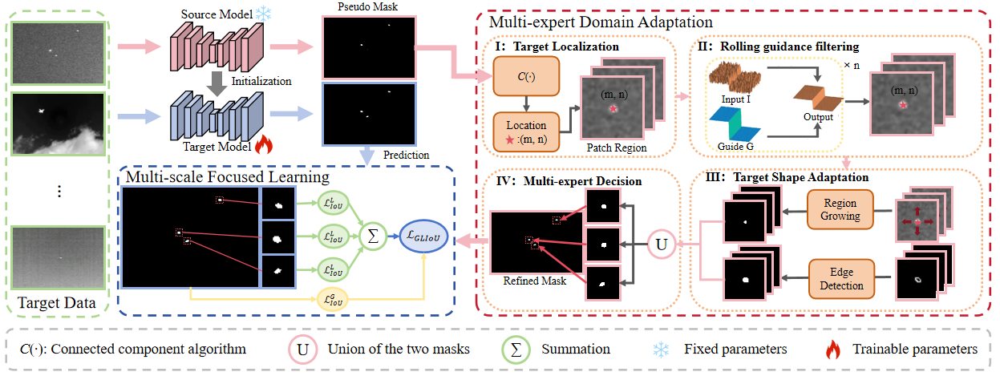

# IRSTD-SFDA

**IRSTD-SFDA is the first source-free domain adaptation framework in infrared small target detection, This framework comprises two key components: Multi-expert Domain Adaptation (MDA) and Multi-scale Focused Learning (MFL). MDA leverages the source model to generate pseudo masks for the target domain, facilitating the transfer of knowledge from the source to the target domain. To account for the inherent diversity of small targets across domains, MDA refines these pseudo masks through a series of operations, including target localization, filtering, shape adaptation, and multi-expert decision, thereby mitigating morphological discrepancies between source and target domains. Meanwhile, MFL employs a global-local fusion strategy to focus on critical regions, enhancing the model's ability to detect small infrared targets. Extensive experimental evaluations across various cross-domain scenarios demonstrate the effectiveness of the proposed framework..**
<br>




**IoU/nIou values achieved by different methods:**

| Methods                           | IS→ND IoU↑ | IS→ND nIoU↑ | IS→NA IoU↑ | IS→NA nIoU↑ | ND→IS IoU↑ | ND→IS nIoU↑ | ND→NA IoU↑ | ND→NA nIoU↑ | NA→IS IoU↑ | NA→IS nIoU↑ | NA→ND IoU↑ | NA→ND nIoU↑ | Avg. |
|-----------------------------------|-------------|--------------|------------|-------------|------------|-------------|------------|-------------|------------|-------------|------------|-------------|------|
| **Source Models**                 |             |              |            |             |            |             |            |             |            |             |            |             |      |
| DNANet              | 38.29       | 43.31        | 72.15      | 75.12       | 14.98      | 29.55       | 30.41      | 40.99       | 42.11      | 54.57       | 48.95      | 59.04       | 45.00|
| UIUNet               | 44.22       | 51.27        | 70.65      | 74.94       | 26.14      | 34.63       | 57.50      | 61.79       | 49.84      | 56.39       | 54.46      | 60.75       | 52.97|
| SCTransNet   | 39.51       | 46.16        | 66.55      | 71.20       | 27.60      | 38.98       | 51.31      | 57.69       | 50.53      | 56.94       | 54.44      | 59.30       | 47.14|
| **U-IRSTD**                       |             |              |            |             |            |             |            |             |            |             |            |             |      |
| WSLCM           | 1.81        | 7.26         | 6.39       | 28.31       | 3.45       | 0.68        | 6.39       | 28.31       | 3.45       | 0.68        | 1.81       | 7.26        | 7.90 |
| NRAM        | 6.93        | 6.19         | 13.54      | 18.95       | 15.25      | 9.90        | 13.54      | 18.95       | 15.25      | 9.90        | 6.93       | 6.19        | 10.09|
| MSLSTIPT      | 8.34        | 7.97         | 1.08       | 0.81        | 11.43      | 5.93        | 1.08       | 0.81        | 11.43      | 5.93        | 8.34       | 7.97        | 5.84 |
| RIPT        | 29.67       | 37.57        | 16.79      | 20.65       | 14.11      | 8.09        | 16.79      | 20.65       | 14.11      | 8.09        | 29.67      | 37.57       | 20.06|
| PSTNN       | 27.86       | 39.31        | 30.30      | 33.67       | 24.57      | 17.93       | 30.30      | 33.67       | 24.57      | 17.93       | 27.86      | 39.31       | 28.78|
| **SFDA-IRSTD**                    |             |              |            |             |            |             |            |             |            |             |            |             |      |
| TT-SFUDA         | 1.91        | 1.54         | 10.36      | 11.43       | 24.68      | 25.46       | 11.19      | 10.56       | 11.37      | 10.59       | 9.28       | 8.77        | 11.39|
| SFDA-DPL       | 3.80        | 4.32         | 2.88       | 3.39        | 1.42       | 1.55        | 3.39       | 3.80        | 0.09       | 0.09        | 0.21       | 0.21        | 2.10 |
| PLDB             | 11.84       | 14.65        | 18.44      | 20.02       | 6.54       | 7.84        | 15.62      | 18.29       | 0.96       | 1.13        | 1.30       | 1.61        | 9.85 |
| IRSTD-SFDA+DNANet               | 41.85       | 46.57        | **73.34**  | **76.64**   | 18.70      | 37.00       | 46.41      | 54.51       | 49.73      | 58.63       | 53.31      | **63.78**   | 51.65|
| IRSTD-SFDA+UIUNet               | **47.77**   | **54.57**    | 71.95      | 76.34       | **39.92**  | **47.64**   | **66.99**  | **72.23**   | **60.31**  | **61.49**   | 55.69      | 61.97       | **55.55**|
| IRSTD-SFDA+SCTransNet           | 45.39       | 50.05        | 70.75      | 74.07       | 32.87      | 46.58       | 65.22      | 71.13       | 55.66      | 60.02       | **55.96**  | 62.23       | 52.58|
## Requirements
- **Python 3**
- **pytorch 1.2.0 or higher**
- **numpy, PIL**
<br><br>
## Datasets
* **NUAA-SIRST** &nbsp; [[download]](https://github.com/YimianDai/sirst) &nbsp; [[paper]](https://arxiv.org/pdf/2009.14530.pdf)
* **NUDT-SIRST** &nbsp; [[download]](https://github.com/YeRen123455/Infrared-Small-Target-Detection) &nbsp; [[paper]](https://ieeexplore.ieee.org/abstract/document/9864119)
* **IRSTD-1K** &nbsp; [[download dir]](https://github.com/RuiZhang97/ISNet) &nbsp; [[paper]](https://ieeexplore.ieee.org/document/9880295)

* **Our project has the following structure:**
  ```
  ├──./datasets/
  │    ├── NUAA-SIRST
  │    │    ├── images
  │    │    │    ├── XDU0.png
  │    │    │    ├── XDU1.png
  │    │    │    ├── ...
  │    │    ├── masks
  │    │    │    ├── XDU0.png
  │    │    │    ├── XDU1.png
  │    │    │    ├── ...
  │    │    ├── img_idx
  │    │    │    ├── train_NUAA-SIRST.txt
  │    │    │    ├── test_NUAA-SIRST.txt
  │    ├── NUDT-SIRST
  │    │    ├── images
  │    │    │    ├── 000001.png
  │    │    │    ├── 000002.png
  │    │    │    ├── ...
  │    │    ├── masks
  │    │    │    ├── 000001.png
  │    │    │    ├── 000002.png
  │    │    │    ├── ...
  │    │    ├── img_idx
  │    │    │    ├── train_NUDT-SIRST.txt
  │    │    │    ├── test_NUDT-SIRST.txt
  │    ├── ...  
  ```


## Commands for Training
* **Run **`train.py`** to perform network training. Example for training [model_name] on [dataset_name] datasets:**
  ```
  $ python train.py --model_name ['DNANet'] --dataset_name ['NUDT-SIRST'] --batchSize 16
  ```
* **Checkpoints and Logs will be saved to **`./log/`**, and the **`./log/`** has the following structure:**
  ```
  ├──./log/
  │    ├── [dataset_name]
  │    │    ├── [model_name]_eopch400.pth.tar
  ```
## Commands for Train-SFDA
* **Run **`train_SFDA.py`** to perform network training. Example for training [model_name] on [dataset_name] datasets:**
  ```
  $ python train.py --model_name 'DNANet' --dataset_name 'NUDT-SIRST' --batchSize 16 --weight_path './preweight/NUDT/DNANet/DNANet_1500.pth.tar'
  ```
* **Checkpoints and Logs will be saved to **`./log/`**, and the **`./log/`** has the following structure:**
  ```
  ├──./log/
  │    ├── [dataset_name]
  │    │    ├── [model_name]_eopch400.pth.tar
  ```


## Train on your own models
* **Create a folder in ```./model```, and put your own model in this folder.**
  ```
  ├──./model/
  │    ├── xxxNet
  │    │    ├── model.py
  ```
* **Add the model in ```model/__init__.py```..**
  ```
  from model.ACM.model_ACM import ASKCResUNet as ACM
  ...
  from model.xxxNet.model import net as xxxNet
  ```
* **Add the model in ```net.py```..**
  ```
  if model_name == 'DNANet':
     self.model = DNANet(mode='train')
  ...
  elif model_name == 'xxxNet':
     self.model = xxxNet()
  ...
## Commands for Test
* **Run **`test.py`** to perform network inference. Example for test [model_name] on [dataset_name] datasets:**
  ```
  $ python test.py --model_name ['DNANet'] --dataset_name ['NUDT-SIRST'] 
  ```
  
* **The PA/mIoU and PD/FA values of each dataset will be saved to** **`./test_[current time].txt`**<br>
* **Network preditions will be saved to** **`./results/`** **that has the following structure**:
  ```
  ├──./results/
  │    ├── [dataset_name]
  │    │   ├── [model_name]
  │    │   │    ├── XDU0.png
  │    │   │    ├── XDU1.png
  │    │   │    ├── ...
  │    │   │    ├── XDU20.png
  ```


## Commands for Evaluate on your own results
* **Please first put your results on** **`./results/`** **that has the following structure:**
  ```
  ├──./results/
  │    ├── [dataset_name]
  │    │   ├── [method_name]
  │    │   │    ├── XDU0.png
  │    │   │    ├── XDU1.png
  │    │   │    ├── ...
  │    │   │    ├── XDU20.png
  ```
* **Run **`evaluate.py`** for direct eevaluation. Example for evaluate [method_name] on [dataset_name] datasets:**
  ```
  $ python evaluate.py --method_name ['DNANet'] --dataset_name ['NUDT-SIRST'] 
  ```
* **The PA/mIoU and PD/FA values of each dataset will be saved to** **`./eval_[current time].txt`**<br><br>


* **Code references [[BasicalRSTD]](https://github.com/XinyiYing/BasicIRSTD),Thanks  for their help.**


